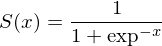

#  Backpropagation in python              


This project is mainly for educational purpose. It will implement neural network backpropagation algorithm.

Currently there are a couple of examples of backpropagation implemented to illustrate few simple problems: 

* bulk computation in neurons - linear algebra, matrix computation
* performance benchmarks
* objective approach 

# Alghorithm

The simple neural network with 3 layers looks like below:


There are two main steps to compute the next iteration - forward and backward pass. 
Every step has been provided with the data from its related demonstration scripts (examples).

## Forwardpropagation
This step aims to calculate the sum of the neurons and applies activation function to determine if the neuron has been activated. 
Let V(x) be the dot product of previous layer neurons values. 


To determine if the neuron activates, now let's apply the activation function. 
The function is well known in neural network world Sigmoid Function 



[x] todo source

hence the Activated value of the neuron used in further computations is equal to $$ A(x) = S(V(x)) $$

## Backpropagation
@TODO

## Example1

Simple backpropagation network problem of grouping of xor outputs with non-linear separation function.

This example demonstrates the weighed neurons in action.

The sigmoid function is used for activating neurons. 

The initial value of input neurons are 1,1 which has been changed to 0.99 to overcome possible division by zero problems.

Example use:

```
python train.py -i xor.csv -n 1000
```

Now the network is trained and we can predict it with the same or another data with the same structure

```
python predict.py -i xor.csv
```

## Features

* Demonstrate backpropagation algorithm in action
* Store the outputs in well structured database
* Use for solving simple problems
* Educational purpose of the program
* Learning python.

## License

This project is released under the MIT Licence.

## References

1. http://latex2png.com/ generating equation images from latex

2. https://www.draw.io/  crating and generating diagram to/from svg

## Author

Daniel Materka
